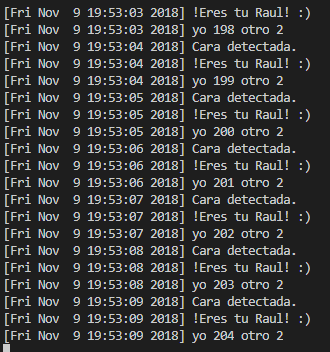
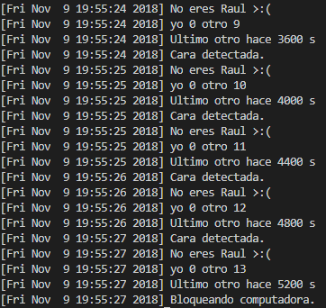

# FaceLock  
Reconoce tu cara y bloquea tu computadora cuando no estas presento o cuando otras personas aparecen.

## Requerimientos
Instalar Tensorflow, Keras y OpenCV.  
```  bash
> pip install tensorflow  
> pip install keras  
> pip install opencv  
```  
(Recuerda usar tensorflow como backend para keras)
Debes contar con cámara web y Windows 10

## Entrenamiento
Para entrenar necesitaras muchas fotos tuyas y de otras personas, las fotos tuyas deberán ir en la carpeta
[data/me](./data/me) y las demás en [data/other](./data/other).

{: width=50%}

Para entrenar poner:

``` bash
> python train.py
```


## Inicialiar FaceLock
Para inicializarlo poner:

``` bash
> python main.py
```





## Obtención de datos
Para la obtención de fotografías utilice la base de datos [chicago_faces](https://chicagofaces.org/default/) solamente tienes que poner
tu nombre, correo, el uso, entre otras cosas. También puedes buscar fotos en redes sociales.

## Recortar fotos
En adición puedes utilizar [cutting_images.py](./cutting_images.py) para recortar las caras en las fotos de manera automática, las imágenes se deben guardar en [./cutting_images](./cutting_images) y separar las fotos como en el entrenamiento ([me](./cutting_images/me) y [other](./cutting_images/other)). Las fotos recortadas se guardaran en [./cutting_images/cut/me](./cutting_images/cut/me) y [./cutting_images/cut/other](./cutting_images/cut/other) respectivamente.

## Acerca del Modo Gris
Puedes utilizar el modo gris para obtener mejores resultados. Para cambiar entre el modo gris y el normal
cambiar a verdadero o falso la variable GREY_MODE el cual se encuentra en [input](./input.py).
  
``` python
# input.py  
GRAY_MODE = True 
```  

## Agradecimientos  
El proyecto de FaceLock fue hecho por [Donny-Hikari](https://github.com/Donny-Hikari) que a su vez se inspiro en el proyecto de [BossSensor](https://github.com/Hironsan/BossSensor) de [Hirosan](https://github.com/Hironsan).

## Licence  
[MIT Licence](./LICENSE)  