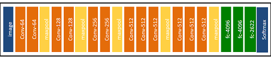

# FaceLock  
Reconoce tu cara y bloquea tu computadora cuando otras personas aparecen.

## Introducción
Este proyecto de redes convolucionales surgió en la clase de redes neuronales del profesor [Julio Waissman](https://github.com/juliowaissman), 
donde nos sugirió que buscaramos en github proyectos que nos llamaran la atención del tema, donde este fue el que me llamo mas
la atención.

## Experiencia
Durante el proceso de entrenamiento de la red, tarde en darme cuenta, que el proyecto donde me estaba basando estaba mal realizado
ya que la manera en como "funcionaba" era sobreaprendiendo las caras, por lo que a la hora de inicializar la aplicacion todas las caras
que detectaba las reconocia como si fuera yo. Por lo tanto me di en la tarea de buscar modelos pre-entrenados para usarlos en el proyecto.

## Modelo
**Keras** trae consigo [modelos](https://keras.io/applications/) para clasificación de imágenes con pesos pre-entrenados con [ImageNet](http://www.image-net.org/), donde probé algunos de ellos quitandoles la ultima capa y entrenandolos con los datos recolectados.
Despues de probar algunos de ellos, ninguno produjo buenos resultados dado que los modelos no son especificamentes para reconocimiento
facial, por lo tanto me di en la busqueda de buscar un modelo especifico para ello, donde encontré a [VGGFace](http://www.robots.ox.ac.uk/~vgg/software/vgg_face/) que fue el que me dio
los mejores resultados.
(VGGFace es una red entrenada con 2.6 millones de rostros)

El modelo de VGGFace es el siguiente:



## Requerimientos
Instalar Tensorflow, Keras y OpenCV.  
```  bash
> pip install tensorflow  
> pip install keras  
> pip install opencv  
```  
(Recuerda usar tensorflow como backend para keras)
Debes contar con cámara web y Windows 10

## Entrenamiento
Para entrenar necesitaras muchas fotos tuyas y de otras personas, las fotos tuyas deberán ir en la carpeta
[data/train/me](./data/train/me) y las demás en [data/train/other](./data/train/other).

(Las imagenes de entrenamiento deben de contener unicamente el rostro, tal
como se muestra en la siguiente imagen)


Para entrenar poner:

``` bash
> python train.py
```

En el entrenamiento se uso la librería hecha por [rcmalli](https://github.com/rcmalli), el cual cual provee
el modelo de VGGFace con pesos pre-entrenados, despues se le agrega una capa de flatten y una densa con activación softmax de 2 clases (me y other) al final, con ADAM como optimizador. 

(El modelo pre-entrenado se descarga al ejecutar el entrenamiento por primera vez)

## Inicialiar FaceLock
Para inicializarlo poner:

``` bash
> python main.py
```


## Obtención de datos
Para la obtención de fotografías utilice la base de datos [chicago_faces](https://chicagofaces.org/default/) solamente tienes que poner
tu nombre, correo, el uso, entre otras cosas. También puedes buscar fotos en redes sociales.
Para las fotos tuyas usar celular, camara o la webcam de tu computadora. ¯\_(ツ)_/¯

## Recortar fotos
En adición puedes utilizar [cutting_images.py](./cutting_images.py) para recortar las caras en las fotos de manera automática, las imágenes se deben guardar en [./cutting_images](./cutting_images) y separar las fotos como en el entrenamiento ([./cutting_images/me](./cutting_images/me) y [./cutting_images/other](./cutting_images/other)). Las fotos recortadas se guardaran en [./cutting_images/cut/me](./cutting_images/cut/me) y [./cutting_images/cut/other](./cutting_images/cut/other) respectivamente. Los recortes se hacen con la libreria de opencv. 
(Ojo en ocaciones recorta cosas que no son caras, revisa despues de usarlo)

## Agradecimientos  
El proyecto de FaceLock fue realizado por [Donny-Hikari](https://github.com/Donny-Hikari) que a su vez se inspiro en el proyecto de [BossSensor](https://github.com/Hironsan/BossSensor) de [Hirosan](https://github.com/Hironsan) el
cual realizo un [blog](http://ahogrammer.com/2016/11/15/deep-learning-enables-you-to-hide-screen-when-your-boss-is-approaching/) del proyecto.
También a [rcmalli](https://github.com/rcmalli/) la cual su librería fue de mucha ayuda.

## Licencia  
Donny-Hikari [MIT Licence](./LICENSE)  
keras-vggface by rcmalli [keras-vggface](https://github.com/rcmalli/keras-vggface/blob/master/LICENSE.txt)